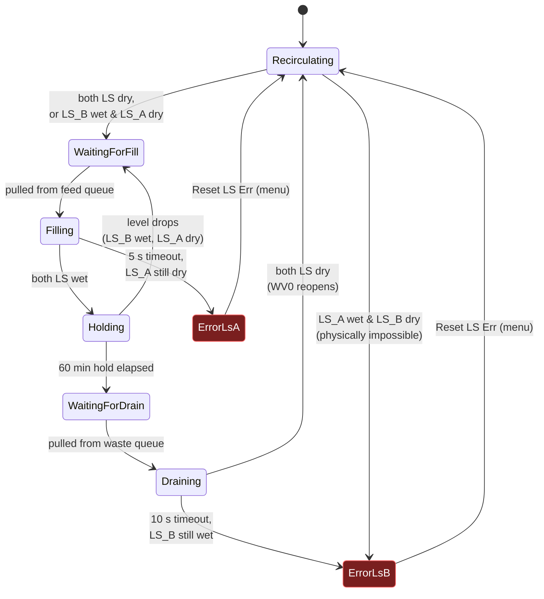

# Reactor Control (Automatic Feeding)

This document covers the automatic feed/drain control system I layered on top of the existing pH/ORP dosing firmware. I left the dosing system (MCP pins 0–5, EZO probes) untouched so it keeps running in parallel.

## What it does

Each Arduino controls **3 reactors**. Per reactor:

- **2 liquid-level sensors**: `LS_A` (upper) and `LS_B` (lower)
- **1 feed valve** (`FV`) on the recirculating feed line from the chilled feed tank
- **1 waste valve** (`WV`) on the drain line to pump 2

Per Arduino, shared across its 3 reactors:

- **1 air-bypass valve** (`WV0`) on the pump 2 suction line. I keep it open by default so pump 2 just pulls air. It closes whenever any of `WV1/WV2/WV3` is open, so pump 2 actually pulls liquid out of the reactor being drained.

Queues:

- I set up one **feed queue** and one **waste queue** per Arduino. Only one feed valve is open at any time on this Arduino, and only one waste valve at a time. When a reactor needs service, it gets appended to the appropriate queue, and I service the next request only after the current valve closes.

I did not implement the cross-Arduino feed queue arbitration yet (the goal there is to share one feed pump across all 12 reactors). The plan is ESP-NOW broadcast with deterministic arbitration.

## Reactor state machine



**Sensor sanity check**: any time the reactor is steady (no valve active), if `LS_A` reads liquid and `LS_B` reads dry (physically impossible since A is above B), I latch `ErrorLsB`.

**Top-up case**: if `LS_B` reads wet and `LS_A` reads dry while in `Holding` or `Recirculating`, the reactor re-enters the feed queue. I reset the 60-min hold timer when filling completes again.

**Boot behavior**: if a reactor boots already full (both LS confirm wet), I transition it straight into `Holding`, so the 60-min timer starts at boot.

## Sensor debouncing

Each LS reading has to hold the same value for a confirmation window before the state machine reacts. I implemented this in [`DebouncedInput`](src/BioReactor/DebouncedInput.h).

| Sensor | Confirm window | Why I chose it |
|---|---|---|
| `LS_A` | 500 ms  | Filling is fast, so I kept the window short to avoid overshoot |
| `LS_B` | 1500 ms | Draining is slow, so I used a longer window to reject splash and bubbles |

Convention: sensor reads **HIGH = no liquid** (I matched the gas-counter pattern). I invert this inside the `Reactor` class so internal state is `lsAConfirmed = liquid present`.

## Pin assignments

### MCP23017 (existing chip, I extended the same one used by pH/ORP)

| MCP pin | Purpose                                    |
|--------:|--------------------------------------------|
| 0–5     | Existing pH/ORP dosing valves *(unchanged)* |
| 6       | FV1, Feed Valve, reactor 1                 |
| 7       | FV2, Feed Valve, reactor 2                 |
| 8       | FV3, Feed Valve, reactor 3                 |
| 9       | WV0, shared air-bypass (default OPEN)      |
| 10      | WV1, Waste Valve, reactor 1                |
| 11      | WV2, Waste Valve, reactor 2                |
| 12      | WV3, Waste Valve, reactor 3                |
| 13–15   | *unused*                                   |

### Arduino Nano ESP32 GPIO (LS digital inputs)

| Arduino pin | Purpose         |
|------------:|-----------------|
| D8          | LS1-A (reactor 1, upper) |
| D9          | LS1-B (reactor 1, lower) |
| D13         | LS2-A (reactor 2, upper) |
| A0          | LS2-B (reactor 2, lower) |
| A1          | LS3-A (reactor 3, upper) |
| A2          | LS3-B (reactor 3, lower) |

I configured these as `pinMode(INPUT)` with no internal pull-up, matching the gas counter wiring. D10–D12 are reserved by other subsystems, so I kept the LS inputs off that range.

## Configurables

All in [`Config.h`](src/BioReactor/Config.h):

```cpp
namespace ReactorTimings
{
  constexpr unsigned long LS_A_CONFIRM_MS  = 500UL;          // upper-sensor debounce
  constexpr unsigned long LS_B_CONFIRM_MS  = 1500UL;         // lower-sensor debounce
  constexpr unsigned long RECIRC_HOLD_MS   = 60UL*60*1000UL; // 60-min hold before drain
  constexpr unsigned long FILL_TIMEOUT_MS  = 5000UL;         // LS_A error watchdog
  constexpr unsigned long DRAIN_TIMEOUT_MS = 10000UL;        // LS_B error watchdog
}

namespace ReactorMappings { const int NUM_REACTORS = 3; }

namespace PinConfigurations
{
  const uint8_t LS_A_PINS[3] = {8, 10, 12};
  const uint8_t LS_B_PINS[3] = {9, 11, 13};
}

namespace McpPins
{
  const int FV[3] = {6, 7, 8};
  const int WV0   = 9;
  const int WV[3] = {10, 11, 12};
}
```

## SD logging

I reused the existing `LOG####.CSV` file. New event rows write through `SdLogger::logReactorEvent(reactorId, eventType, durationMs)` and land in the message column. Examples:

```
2026-05-13 14:02:11,,,,,,,R1:FV_OPEN
2026-05-13 14:02:14,,,,,,,R1:FV_CLOSE dur=3104ms
2026-05-13 15:02:14,,,,,,,R-:WV0_CLOSE
2026-05-13 15:02:14,,,,,,,R1:WV_OPEN
2026-05-13 15:02:22,,,,,,,R1:WV_CLOSE dur=8421ms
2026-05-13 15:02:22,,,,,,,R-:WV0_OPEN
2026-05-13 16:11:03,,,,,,,R2:LS_A_ERROR
2026-05-13 16:11:03,,,,,,,LS errors reset
```

Event types: `FV_OPEN`, `FV_CLOSE`, `WV_OPEN`, `WV_CLOSE`, `WV0_OPEN`, `WV0_CLOSE`, `LS_A_ERROR`, `LS_B_ERROR`. I use 1-indexed reactor IDs in the log, and `R-` for shared (per-Arduino) events like WV0 toggles.

## Menu additions

The LCD main menu now has 4 items:

```
MAIN MENU
Calibrate Probes
Valve Control
Reactors                Exit
```

`Reactors` opens the new submenu I added:

| Item | Behavior |
|---|---|
| **Status** | Live read-only screen showing state name, `LS_A`/`LS_B`, and `FV`/`WV` flags per reactor. Press the joystick to return. |
| **Manual Valves** | Toggle any of `FV1/FV2/FV3/WV0/WV1/WV2/WV3` by hand. State indicators are `+` / `-`. Manual control is independent of the state machine, so use with care. |
| **Reset LS Err** | Clears `LS_A`/`LS_B` error latches on all 3 reactors and returns errored reactors to `Recirculating`. |
| **Back** | Return to main menu. |

To take a reactor fully off automatic control, set `config.reactorAutoEnabled = false`. While disabled, the state machine still updates sensor readings and reactor state for display and logging, but no valve transitions happen automatically. WV0 still tracks active WV state.

## File map

| File | Role |
|---|---|
| [`DebouncedInput.h`](src/BioReactor/DebouncedInput.h) | Generic confirm-time digital input. |
| [`Reactor.h`](src/BioReactor/Reactor.h) / [`.cpp`](src/BioReactor/Reactor.cpp) | Per-reactor state machine, watchdogs, sensor ownership. |
| [`ReactorController.h`](src/BioReactor/ReactorController.h) / [`.cpp`](src/BioReactor/ReactorController.cpp) | Owns the 3 reactors, feed/waste queues, WV0 state, manual overrides. |
| [`Mcp.cpp`](src/BioReactor/Mcp.cpp) | I extended `begin()` to configure MCP pins 6–12 as outputs, pre-open WV0 at boot, and exposed `setPin()`. |
| [`Sd.cpp`](src/BioReactor/Sd.cpp) | Added `logReactorEvent()`. |
| [`Menu.cpp`](src/BioReactor/Menu.cpp) | Added Reactors submenu with status, manual, and reset screens. |
| [`Config.h`](src/BioReactor/Config.h) | All new pin, timing, and state additions. |
| [`BioReactor.ino`](src/BioReactor/BioReactor.ino) | Instantiates `ReactorController` and calls `update()` each loop. |

## Future work

- **Cross-Arduino feed queue** over ESP-NOW so all 12 reactors share one feed pump. The plan: each ESP32 broadcasts feed-queue requests and observed completions, and the lowest MAC arbitrates ownership of the shared pump.
- **Configurable timing at runtime** via the menu. Right now I kept the timings as `constexpr` in `Config.h`. I would switch to `inline` mutable variables once an editing UI is added.
- **Per-reactor drain hold offset** if simultaneous drains across an Arduino become a bottleneck.
